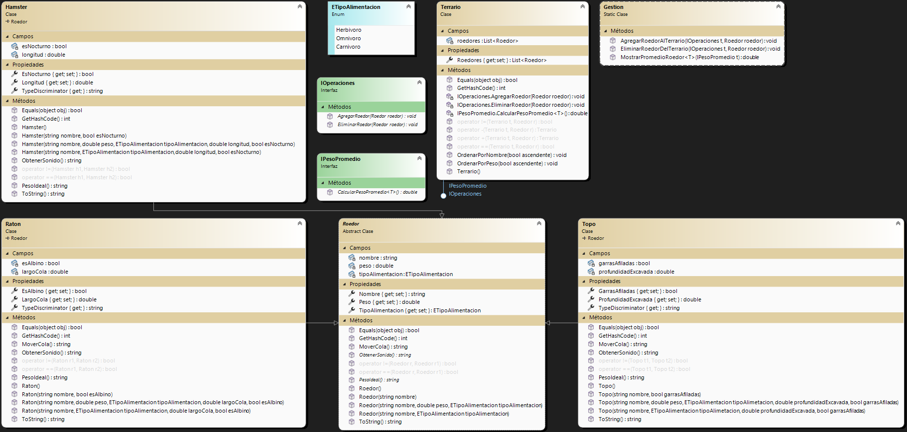

# CRUD - Gestión de Roedores de Veterinaria - SP
Primer y segundo parcial de Laboratorio 2

```
Alumno:
 - Valentín Jorge Brazanovich          vvalente00@gmail.com
División: 1C
          ---- Primer cuatrimestre 2024 ----

Fecha de entrega: 03/07/2024
```

## Sobre mí: 
Mi nombre es Valentín Jorge Brazanovich y estoy estudiando la Tecnicatura Universitaria en Programación. 
Este proyecto es una demostración de mis capacidades creando código en C# y manejo de archivos y bases de datos más la realización del CRUD con estos.

## Resumen: 
La aplicación permite al usuario gestionar la información de diferentes tipos de roedores (Hámsters, Ratones, Topos). Las funcionalidades incluyen:
- **Login de usuario**: Permite el acceso a la aplicación.


- **Registro de accesos**: Guarda la información del usuario que ha ingresado, incluyendo la fecha y hora para luego visualizarla en un log que el *ADMINISTRADOR*
puede ver haciendo click en el ToolStrip "Ver/Registros".


- **Serialización y deserialización**: Guarda y recupera la información de los roedores en formatos JSON, XML y en *base de datos*.
- **Visualizacion de Roedores**: Se pueden agregar, modificar y eliminar Roedores y cada uno tiene características específicas.
También se los puede ordenar por peso/nombre de mayor a menor o viceversa y se puede calcular el promedio de peso según tipo de roedor.


- **Base de datos**: Cuando se deserializa la *base de datos* aparece un aviso en la esquina superior derecha que advierte que se está utilizando la misma, 
por lo cual, al modificar o eliminar algún roedor este también se modificará/eliminará de la *base de datos*.


## Diagrama de clases

Este es el diagrama de clases con el Formulario principal, la clase Padre (Roedor) y sus Derivadas (Hamster, Raton, Topo).
Puede hacer click en la imágen para verla más clara.


Dentro de la carpeta VeterinariaExoticos hay un archivo .JSON y otro .XML ya cargados para deserializar y mostrar en el visor. Tambien se incluye un script.sql en
la carpeta "Script" que contiene el código necesario para crear la base de datos requerida junto con 3 roedores. La *base de datos* tiene como nombre "Terrario_base"
y contiene una tabla "Roedores" con los campos necesarios para contener cualquier instancia de las clases derivadas de Roedor. La misma se creará en C:\SQLData\DATA.
Dentro de la carpeta Usuarios se encuentra el archivo MOCK_DATA.json y el archivo .log de usuarios que es en donde está el registro de los mismos usuarios que entraron.

**Cualquiera sea el caso, el script es el siguiente:**

USE [master]
GO
/****** Object:  Database [Terrario_base]    Script Date: 30/6/2024 01:59:34 ******/
CREATE DATABASE [Terrario_base]
 CONTAINMENT = NONE
 ON  PRIMARY 
( NAME = N'Terrario_base', FILENAME = N'C:\SQLData\DATA\Terrario_base.mdf' , SIZE = 8192KB , MAXSIZE = 10240KB , FILEGROWTH = 1024KB )
 LOG ON 
( NAME = N'Terrario_base_log', FILENAME = N'C:\SQLData\DATA\Terrario_base_log.ldf' , SIZE = 1024KB , MAXSIZE = 10240KB , FILEGROWTH = 1024KB )
 WITH CATALOG_COLLATION = DATABASE_DEFAULT, LEDGER = OFF
GO
ALTER DATABASE [Terrario_base] SET COMPATIBILITY_LEVEL = 160
GO
IF (1 = FULLTEXTSERVICEPROPERTY('IsFullTextInstalled'))
begin
EXEC [Terrario_base].[dbo].[sp_fulltext_database] @action = 'enable'
end
GO
ALTER DATABASE [Terrario_base] SET ANSI_NULL_DEFAULT OFF 
GO
ALTER DATABASE [Terrario_base] SET ANSI_NULLS OFF 
GO
ALTER DATABASE [Terrario_base] SET ANSI_PADDING OFF 
GO
ALTER DATABASE [Terrario_base] SET ANSI_WARNINGS OFF 
GO
ALTER DATABASE [Terrario_base] SET ARITHABORT OFF 
GO
ALTER DATABASE [Terrario_base] SET AUTO_CLOSE ON 
GO
ALTER DATABASE [Terrario_base] SET AUTO_SHRINK OFF 
GO
ALTER DATABASE [Terrario_base] SET AUTO_UPDATE_STATISTICS ON 
GO
ALTER DATABASE [Terrario_base] SET CURSOR_CLOSE_ON_COMMIT OFF 
GO
ALTER DATABASE [Terrario_base] SET CURSOR_DEFAULT  GLOBAL 
GO
ALTER DATABASE [Terrario_base] SET CONCAT_NULL_YIELDS_NULL OFF 
GO
ALTER DATABASE [Terrario_base] SET NUMERIC_ROUNDABORT OFF 
GO
ALTER DATABASE [Terrario_base] SET QUOTED_IDENTIFIER OFF 
GO
ALTER DATABASE [Terrario_base] SET RECURSIVE_TRIGGERS OFF 
GO
ALTER DATABASE [Terrario_base] SET  DISABLE_BROKER 
GO
ALTER DATABASE [Terrario_base] SET AUTO_UPDATE_STATISTICS_ASYNC OFF 
GO
ALTER DATABASE [Terrario_base] SET DATE_CORRELATION_OPTIMIZATION OFF 
GO
ALTER DATABASE [Terrario_base] SET TRUSTWORTHY OFF 
GO
ALTER DATABASE [Terrario_base] SET ALLOW_SNAPSHOT_ISOLATION OFF 
GO
ALTER DATABASE [Terrario_base] SET PARAMETERIZATION SIMPLE 
GO
ALTER DATABASE [Terrario_base] SET READ_COMMITTED_SNAPSHOT OFF 
GO
ALTER DATABASE [Terrario_base] SET HONOR_BROKER_PRIORITY OFF 
GO
ALTER DATABASE [Terrario_base] SET RECOVERY SIMPLE 
GO
ALTER DATABASE [Terrario_base] SET  MULTI_USER 
GO
ALTER DATABASE [Terrario_base] SET PAGE_VERIFY CHECKSUM  
GO
ALTER DATABASE [Terrario_base] SET DB_CHAINING OFF 
GO
ALTER DATABASE [Terrario_base] SET FILESTREAM( NON_TRANSACTED_ACCESS = OFF ) 
GO
ALTER DATABASE [Terrario_base] SET TARGET_RECOVERY_TIME = 60 SECONDS 
GO
ALTER DATABASE [Terrario_base] SET DELAYED_DURABILITY = DISABLED 
GO
ALTER DATABASE [Terrario_base] SET ACCELERATED_DATABASE_RECOVERY = OFF  
GO
ALTER DATABASE [Terrario_base] SET QUERY_STORE = ON
GO
ALTER DATABASE [Terrario_base] SET QUERY_STORE (OPERATION_MODE = READ_WRITE, CLEANUP_POLICY = (STALE_QUERY_THRESHOLD_DAYS = 30), DATA_FLUSH_INTERVAL_SECONDS = 900, INTERVAL_LENGTH_MINUTES = 60, MAX_STORAGE_SIZE_MB = 1000, QUERY_CAPTURE_MODE = AUTO, SIZE_BASED_CLEANUP_MODE = AUTO, MAX_PLANS_PER_QUERY = 200, WAIT_STATS_CAPTURE_MODE = ON)
GO
USE [Terrario_base]
GO
/****** Object:  Table [dbo].[Roedor]    Script Date: 30/6/2024 01:59:34 ******/
SET ANSI_NULLS ON
GO
SET QUOTED_IDENTIFIER ON
GO
CREATE TABLE [dbo].[Roedor](
	[Id] [int] IDENTITY(1,1) NOT NULL,
	[Nombre] [nvarchar](50) NOT NULL,
	[Peso] [float] NOT NULL,
	[TipoAlimentacion] [int] NOT NULL,
	[Longitud] [float] NULL,
	[EsNocturno] [bit] NULL,
	[LargoCola] [float] NULL,
	[EsAlbino] [bit] NULL,
	[ProfundidadExcavada] [float] NULL,
	[GarrasAfiladas] [bit] NULL,
	[TipoRoedor] [int] NOT NULL,
 CONSTRAINT [PK_Roedor] PRIMARY KEY CLUSTERED 
(
	[Id] ASC
)WITH (PAD_INDEX = OFF, STATISTICS_NORECOMPUTE = OFF, IGNORE_DUP_KEY = OFF, ALLOW_ROW_LOCKS = ON, ALLOW_PAGE_LOCKS = ON, OPTIMIZE_FOR_SEQUENTIAL_KEY = OFF) ON [PRIMARY]
) ON [PRIMARY]
GO
SET IDENTITY_INSERT [dbo].[Roedor] ON 

INSERT [dbo].[Roedor] ([Id], [Nombre], [Peso], [TipoAlimentacion], [Longitud], [EsNocturno], [LargoCola], [EsAlbino], [ProfundidadExcavada], [GarrasAfiladas], [TipoRoedor]) VALUES (1, N'Hammy', 50, 1, 6, 1, NULL, NULL, NULL, NULL, 0)
INSERT [dbo].[Roedor] ([Id], [Nombre], [Peso], [TipoAlimentacion], [Longitud], [EsNocturno], [LargoCola], [EsAlbino], [ProfundidadExcavada], [GarrasAfiladas], [TipoRoedor]) VALUES (3, N'Jamon', 30, 0, NULL, NULL, 6, 0, NULL, NULL, 1)
INSERT [dbo].[Roedor] ([Id], [Nombre], [Peso], [TipoAlimentacion], [Longitud], [EsNocturno], [LargoCola], [EsAlbino], [ProfundidadExcavada], [GarrasAfiladas], [TipoRoedor]) VALUES (4, N'Topon', 80, 2, NULL, NULL, NULL, NULL, 12, 1, 2)
SET IDENTITY_INSERT [dbo].[Roedor] OFF
GO
USE [master]
GO
ALTER DATABASE [Terrario_base] SET  READ_WRITE 
GO

