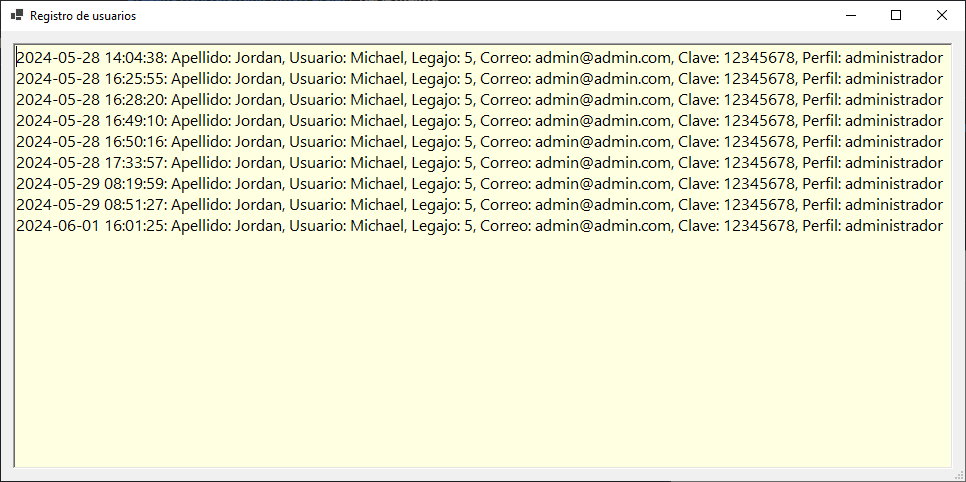
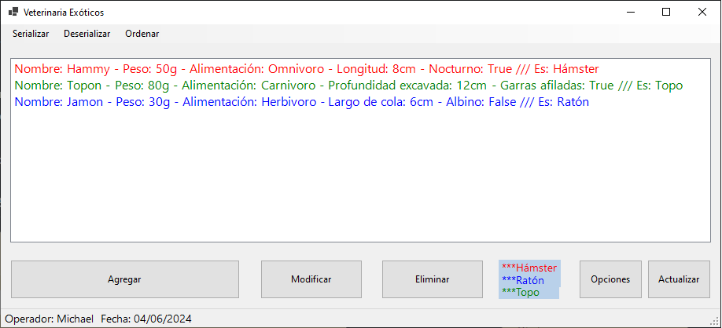
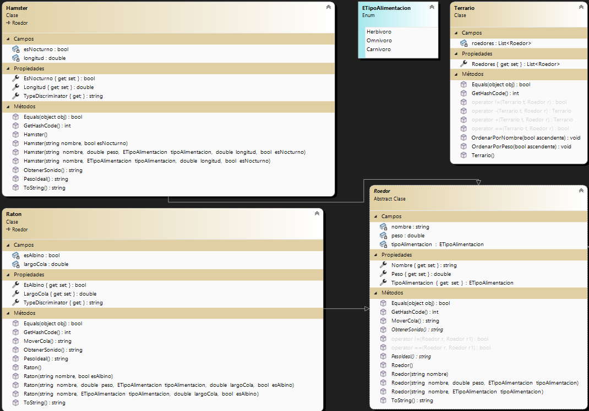
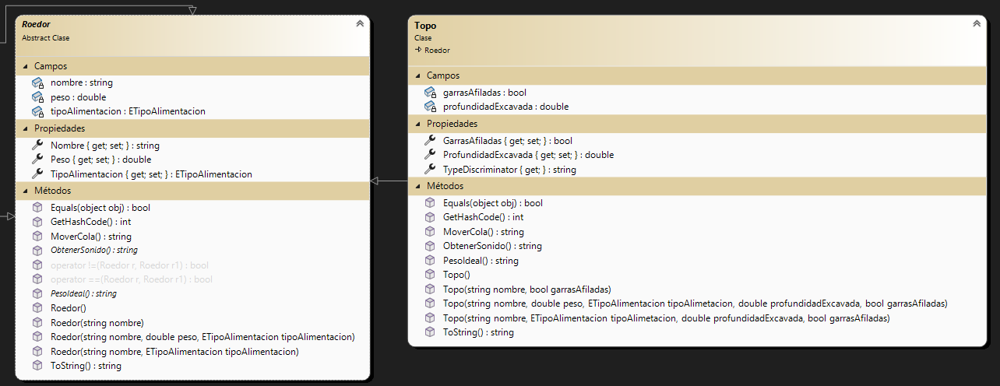

# CRUD - Gestión de Roedores
Primer parcial de Laboratorio 2

```
Alumno:
 - Valentín Jorge Brazanovich          vvalente00@gmail.com
División: 1C
          ---- Primer cuatrimestre 2024 ----

Fecha de entrega: 29/05/2024
```

## Sobre mí: 
Mi nombre es Valentín Jorge Brazanovich y estoy estudiando la Tecnicatura Universitaria en Programación. 
Este proyecto es una demostración de mis capacidades creando código en C# y la buena implementación de Clases e Interfaz de Usuario (UI).

## Resumen: 
La aplicación permite al usuario gestionar la información de diferentes tipos de roedores (Hámsters, Ratones, Topos). Las funcionalidades incluyen:
- **Login de usuario**: Permite el acceso a la aplicación.                                                                                   

- **Registro de accesos**: Guarda la información del usuario que ha ingresado, incluyendo la fecha y hora para luego visualizarla en un log.



- **Serialización y deserialización**: Guarda y recupera la información de los roedores en formatos JSON y XML.


- **Visualizacion de Roedores**: Se pueden agregar, modificar y eliminar Roedores y cada uno tiene características específicas.


## Diagrama de clases


Este es el diagrama de clases con la clase Padre (Roedor) y sus Derivadas (Hamster, Raton, Topo).

Dentro de la carpeta VeterinariaExoticos hay un archivo .JSON y otro .XML ya cargados para deserializar y mostrar en el visor.
