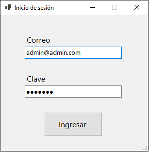

# CRUD - Gestión de Roedores de Veterinaria - SP
Primer parcial de Laboratorio 2

```
Alumno:
 - Valentín Jorge Brazanovich          vvalente00@gmail.com
División: 1C
          ---- Primer cuatrimestre 2024 ----

Fecha de entrega: 03/07/2024
```

## Sobre mí: 
Mi nombre es Valentín Jorge Brazanovich y estoy estudiando la Tecnicatura Universitaria en Programación. 
Este proyecto es una demostración de mis capacidades creando código en C# y mis capacidades de manejar archivos y bases de datos y la realización del CRUD con estos.

## Resumen: 
La aplicación permite al usuario gestionar la información de diferentes tipos de roedores (Hámsters, Ratones, Topos). Las funcionalidades incluyen:
- **Login de usuario**: Permite el acceso a la aplicación.




- **Registro de accesos**: Guarda la información del usuario que ha ingresado, incluyendo la fecha y hora para luego visualizarla en un log que el *ADMINISTRADOR*
puede ver haciendo click en el ToolStrip "Ver/Registros".


- **Serialización y deserialización**: Guarda y recupera la información de los roedores en formatos JSON, XML y en *base de datos*.
- **Visualizacion de Roedores**: Se pueden agregar, modificar y eliminar Roedores y cada uno tiene características específicas.
También se los puede ordenar por peso/nombre de mayor a menor o viceversa y se puede calcular el promedio de peso según tipo de roedor.


- **Base de datos**: Cuando se deserializa la *base de datos* aparece un aviso en la esquina superior derecha que advierte que se está utilizando la misma, 
por lo cual, al modificar o eliminar algún roedor este también se modificará/eliminará de la *base de datos*.


## Diagrama de clases

Este es el diagrama de clases con el Formulario principal, la clase Padre (Roedor) y sus Derivadas (Hamster, Raton, Topo)


Dentro de la carpeta VeterinariaExoticos hay un archivo .JSON y otro .XML ya cargados para deserializar y mostrar en el visor. Tambien se incluye un script.sql en
la carpeta "Script" que contiene el código necesario para crear la base de datos requerida junto con 3 roedores. La *base de datos* tiene como nombre "Terrario_base"
y contiene una tabla "Roedores" con los campos necesarios para contener cualquier instancia de las clases derivadas de Roedor. La misma se creará en C:\SQLData\DATA.
